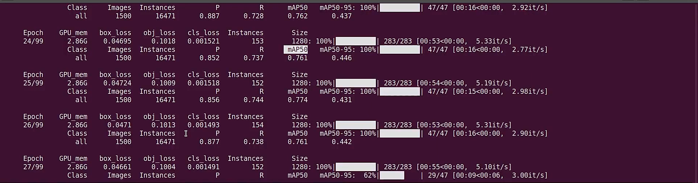
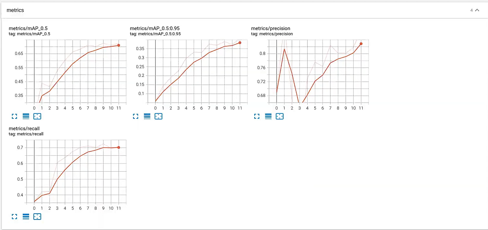
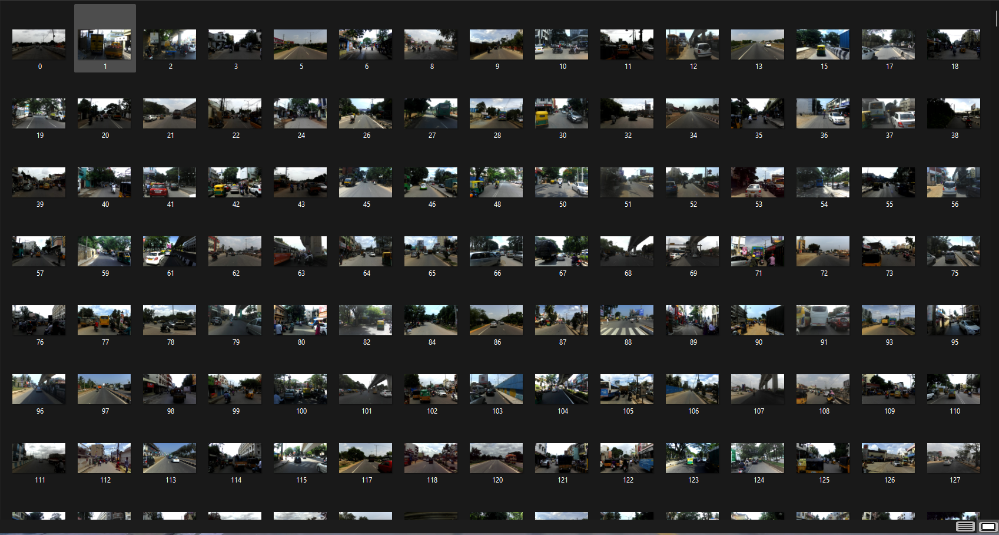
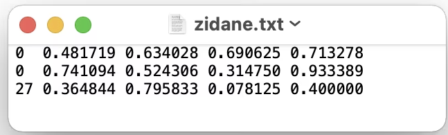
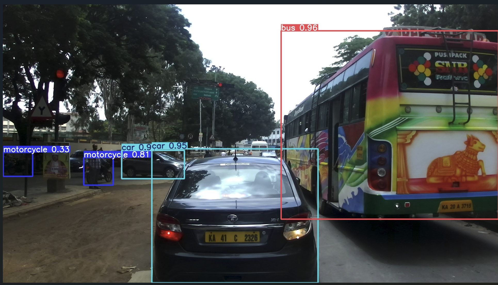
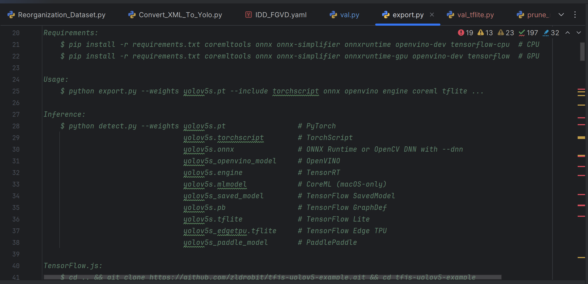
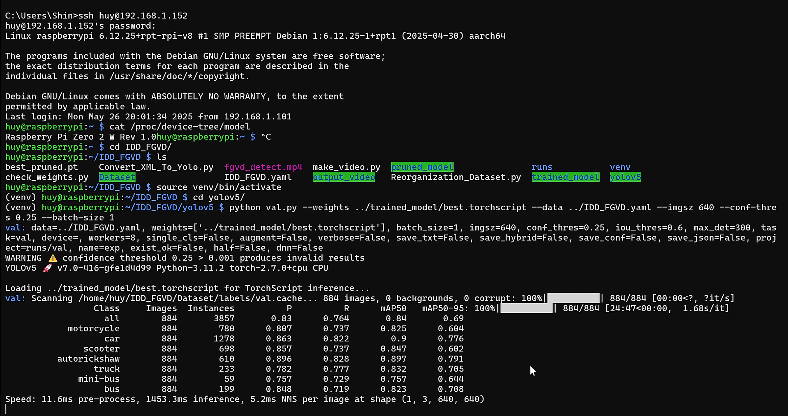
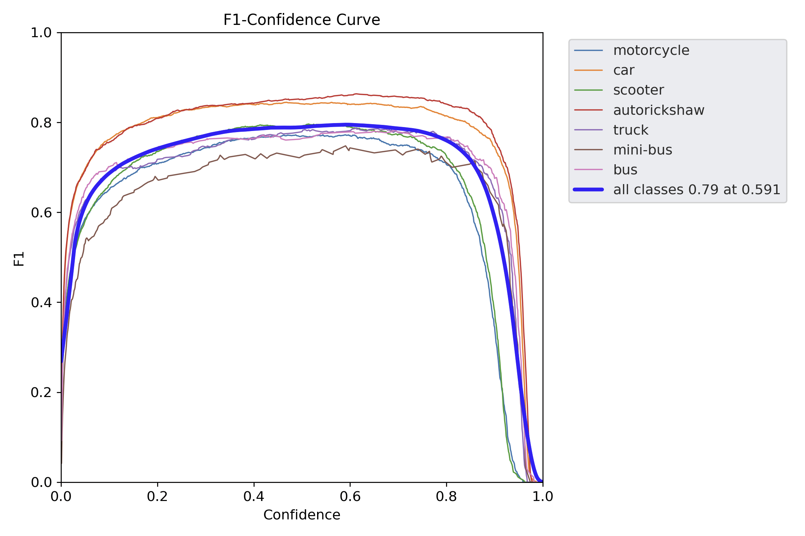
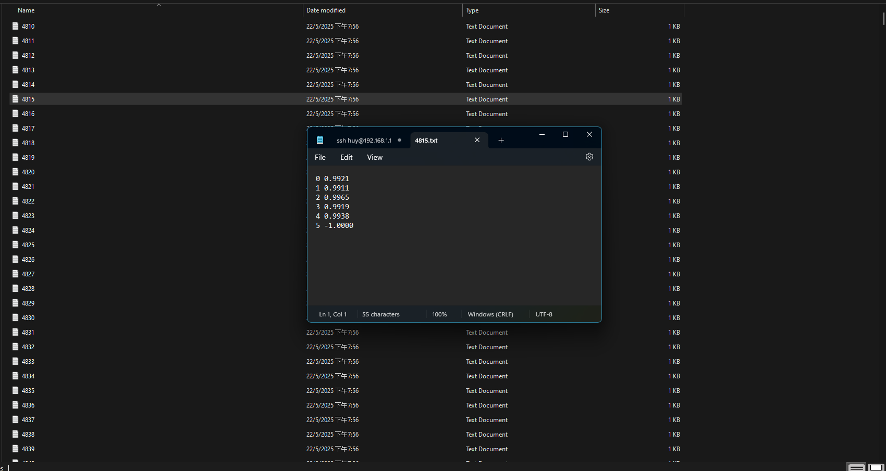

# OBJECT DETECTION IDD_FGVD

# LIBRARY
    Ultralytics 🚀 AGPL-3.0 License - https://ultralytics.com/license
    
    YOLOv5 

    
# MODEL TRAINING PROCESS 



# METRIC ON TENSORBOARD 



# STRUCTURE 

    IDD_FGVD
├── .idea/ # PyCharm project settings


├── .venv/ # Python virtual environment

├── Recognize_Dataset #Config dataset so that fit with yolov5


├── Dataset/ # Original dataset


├── best_pruned


├── model_trained/ # Trained models directory


│ ├── best.pt # Best performing model


│ └── last.pt # Last checkpoint


├── output/ # Output results


├── yolov5/ # YOLOv5 core code

│ ├── best.pt # YOLOv5 detection script

│ ├── last.pt # YOLOv5 detection script

│ ├── best.torchscript # YOLOv5 detection script

│ ├── last.torchscript # YOLOv5 detection script


│ ├── detect.py # YOLOv5 detection script


│ ├── models/ # Model definitions


│ └── utils/ # Utility functions


└── README.md # Project documentation


In repo, I can't load folder modeled_trained include best.pt and last.pt that I trained. You can retrain as run terminal by code :


    python train.py \
      --img 1280 \
      --batch 8 \
      --epochs 100 \
      --data IDD_FGVD.yaml \
      --weights yolov5n.pt \
      --project model_trained \
      --name best \
      --exist-ok

      
    Then, you have two file best.pt and last.pt 
# HYPER PARAMETERS 

|STT|Parameters|Value Default|
|---|----------|-------------|
|1|root|Checked_Dataset|
|2|epochs|100|
|3|batch-size|8|
|4|image-size|1280-1280|
|5|modeled_trained|best.pt|
|6|checkpoint|None|
|7|use-wandb|None|

#   YOLO SOURCE CODE EDITING

     1.  Source YoloV5 : 

:rocket: git clone https://github.com/ultralytics/yolov5.git

:rocket: python detect_track.py --weights yolov5m.pt --source data/image 

:rocket: cd yolov5

:rocket: pip install -r requirements.txt

     2.  IDD_FGVD.py 

**_Mission_** : Bring labeled video data and annotations back to the data yolo needs !

**_Reference_** : https://docs.ultralytics.com/vi/yolov5/tutorials/train_custom_data/#12-leverage-models-for-automated-labeling

> _Images_ : 



:rocket: You just need to read the video with opencv, then get each frame, then rename the read frames in order with your code.

> _Labels_ :





:rocket: You just need to get the object's labels data, along with the object's bounding box in the annotations file and you're done.

:fire: The first column is the class of the object
:fire: The next four columns are numbers that define the bounding box of that object : x_center, y_center, w, h

### 🔍 Sample: _Main source code prepare data_ : 
```python
for idx, path_val in enumerate(paths_val):

    video = cv2.VideoCapture("{}.mp4".format(path_val))
    num_frames = int(video.get(cv2.CAP_PROP_FRAME_COUNT))

    with open("{}.json".format(path_val), "r") as json_file:
        json_data = json.load(json_file)

    if num_frames != len(json_data["images"]):
        print("Something is wrong with the game {}".format(path_val))
        paths_val.remove(path_val)

    width = json_data["images"][0]["width"]
    height = json_data["images"][0]["height"]

    all_objects = [
        {
            "image_id": obj["image_id"],
            "bbox": obj["bbox"],
            "category_id": obj["category_id"]
        }
        for obj in json_data["annotations"]
        if obj["category_id"] in [3, 4]
    ]

    frame_counter = 0
    while video.isOpened():
        flag, frame = video.read()
        if not flag:
            break


```

        3. IDD_FGVD.yaml

:rocket: _In this file, you need to connect the prepared data to the model._

```python
# Dataset root directory relative to the yolov5 directory
path: E:\your_source_data\


# Train/val/test sets: specify directories, *.txt files, or lists
train: images/train # 128 images for training
val: images/val # 128 images for validation
test: # Optional path to test images

# Classes (example using 80 COCO classes)
names:
    0: motorcycle
    1: car
    2: scooter
    3: autorickshaw
    4: truck
    5: mini-bus
    6: bus

```
:fire: _Define class for model_ : 0 - _motorcycle_ | 1 - _car_ | 2 - _scooter_ | 3 - _autorickshaw_ | 4 - _truck_  |  5: mini-bus | 6: bus

        4. detect_track.py

**_Mission_** : With yolo's detect.py source code available, you have to add tracking to this source code.

:rocket: At that time, the object will display both the bounding box and the ID as shown below:



:fire: _Assigning an ID to each subject will help track them in real time. When they leave the frame and come back, we still know it's the same person!_

        5. export.py 

:rocket: You just use export.py file in folder yolov5 so that convert best.pt to best.torchscript 



:fire: 

    python export.py --weights best.pt --include torchscript


# How to use my code on laptop ?

- Train your model by running python train.py. For example: 
python train.py \
  --img 1280 \
  --batch 8 \
  --epochs 100 \
  --data IDD_FGVD.yaml \
  --weights yolov5n.pt \
  --project model_trained \
  --name best \
  --exist-ok
- Test your trained model by running python test.py. For example: 
python detect_track.py \
  --img 1280 \
  --batch 8 \
  --data IDD_FGVD.yaml \
  --weights model_trained/best.pt

- Validation your trained model by running python test.py. For example: 
python val.py \
  --img 1280 \
  --batch 8 \
  --data IDD_FGVD.yaml \
  --weights model_trained/best.pt


# Result 



# How to use my code on pi zero 2w ?

:rocket: You must connect laptop into pi zero 2w as ssh, then you need transfer project in ssh as scp

:fire: Then, you must run file val.py with model best.torchscript

    How to run ? 

     python val.py --weights ../trained_model/best.torchscript --data ../IDD_FGVD.yaml --imgsz 640 --conf-thres 0.25 --batch-size 1

:fire: Then, the result will appear in folder yolov5/runs/val 

    What are the results?

    The result will appear image F1_curve, file txt contain iou_result. MAP will appear in terminal after the assessment is complete. 

:fire: F1_curve : 







